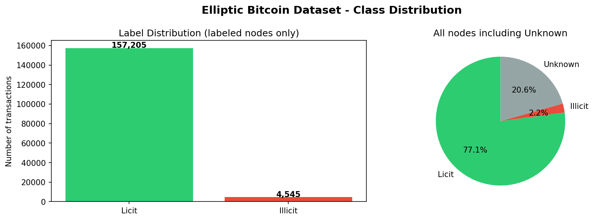
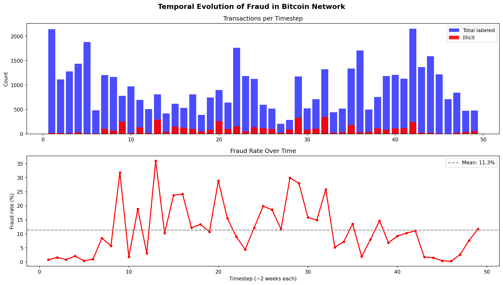
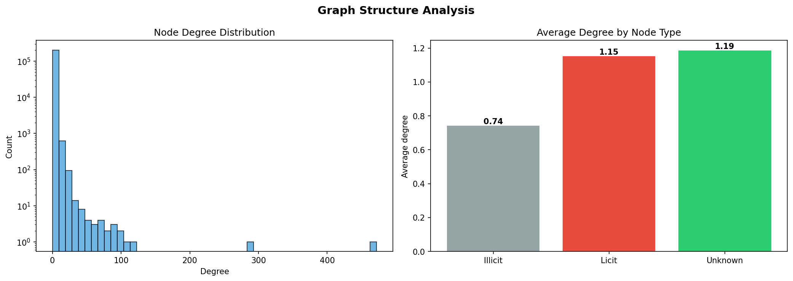

# Bitcoin Fraud Detection with Graph Neural Networks

Detecting illicit transactions in the Bitcoin network using GNNs on the Elliptic dataset.


## The Problem

Financial fraud costs billions annually. Rule-based systems generate 95%+ false positives,
wasting investigator time. Graph Neural Networks detect fraud patterns invisible to 
per-transaction models, illicit transactions cluster in the payment network in ways 
that only emerge when you look at the graph structure.

## Dataset

The [Elliptic Bitcoin Dataset](https://www.kaggle.com/datasets/ellipticco/elliptic-data-set) 
contains 203,769 Bitcoin transactions and 234,355 payment flows, with 2% labeled as illicit.



## Approach

Three models trained on timesteps 1-34 and evaluated on 35-49 (temporal split):

| Model | AUC | Illicit Recall | Illicit Precision |
|-------|-----|---------------|-------------------|
| Random Forest (baseline) | 0.95 | 11% | 74% |
| GCN | 0.80 | 41% | 13% |
| GAT | 0.82 | 43% | 12% |

**Key result:** GNNs detect 4x more fraud than the tabular baseline, 
at the cost of more false positives - the right trade-off when missing 
fraud is more costly than investigating alerts.

## Temporal Analysis

Fraud is not static. The dataset spans 49 timesteps (~2 weeks each), 
and fraud rate oscillates between 0% and 35% depending on the period.
This motivates temporal modeling over static approaches.



## Graph Structure

The network follows a power-law degree distribution typical of real-world graphs.
Illicit nodes have slightly lower average degree (0.74) than licit ones (1.15),
suggesting fraudulent transactions avoid highly connected nodes.



## Graph Visualization

2-hop neighborhood around illicit nodes (timestep 5). Red = illicit, green = licit, gray = unknown.
Illicit nodes tend to cluster together, forming detectable patterns in the transaction network.


## Project Structure

```
bitcoin-fraud-gnn/
├── notebooks/
│   ├── 01_eda.ipynb          # Exploratory data analysis
│   ├── 02_baseline.ipynb     # Random Forest baseline
│   ├── 03_gcn.ipynb          # Graph Convolutional Network
│   └── 04_gat.ipynb          # Graph Attention Network
├── src/                      # Reusable model code (coming soon)
├── app/                      # Streamlit demo (coming soon)
├── assets/                   # Plots and visualizations
└── requirements.txt
```

## Key Findings

- Graph structure carries signal invisible to tabular models (+30% recall)
- Illicit nodes have lower average degree (0.74 vs 1.15 for licit nodes),
  suggesting fraudulent transactions avoid highly connected hubs
- Temporal split is critical: random split leaks future fraud patterns into training,
  giving artificially inflated results

## How to Run

```bash
git clone https://github.com/TU_USUARIO/bitcoin-fraud-gnn.git
cd bitcoin-fraud-gnn
python -m venv venv
source venv/bin/activate
pip install -r requirements.txt
jupyter lab
```

## Author

**Lino Vives** - Mathematics & Software Engineering student at U-Tad  
[LinkedIn](https://linkedin.com/in/lino-vives) 
